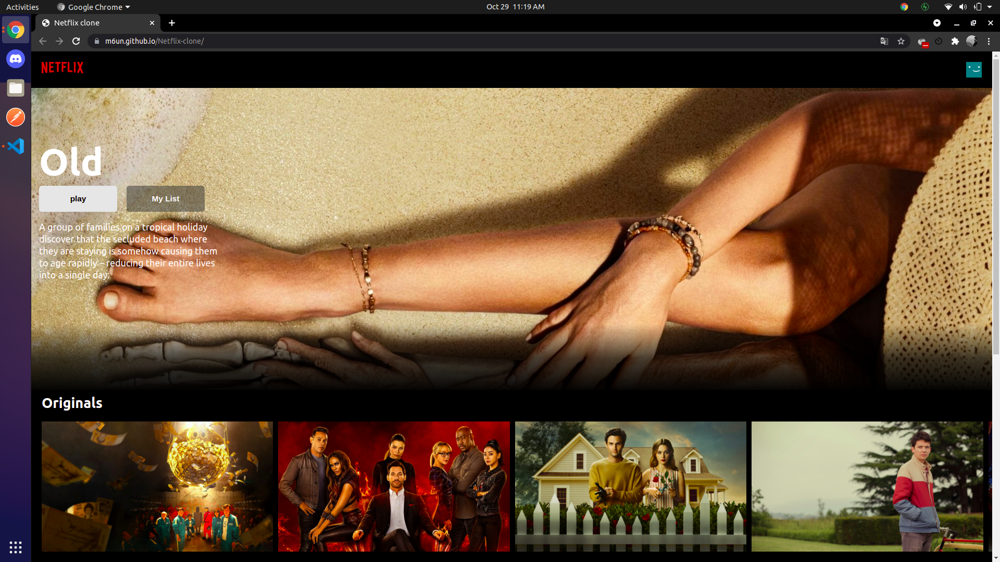
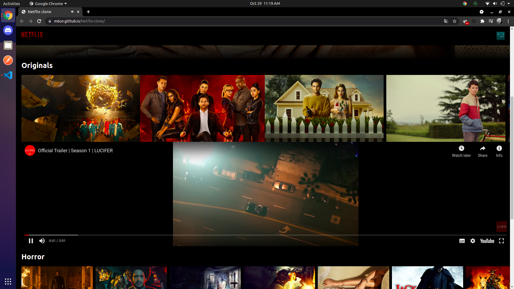
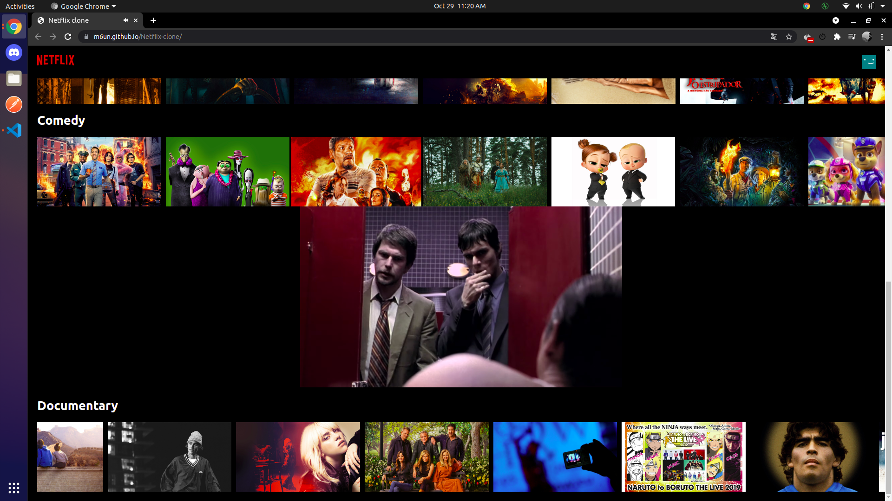

# Netflix-clone
### [Live Site](https://m6un.github.io/Netflix-clone)

 

This is a simplified front-end clone of netflix made using reactJs and CSS(flexbox). Its uses the MovieDB api

Setup:
- run ```npm i && npm start``` to start the development server
